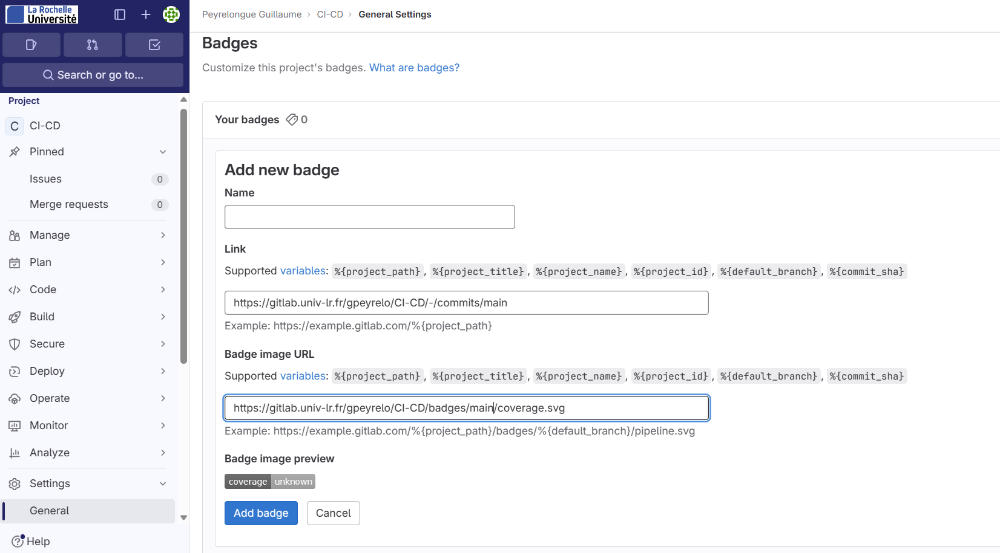
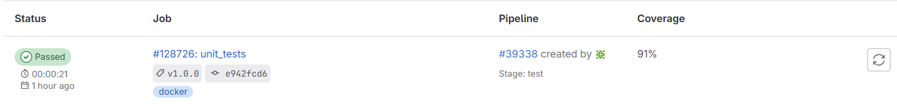
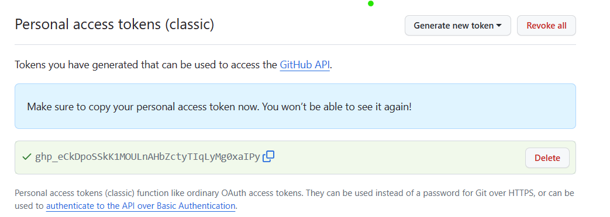
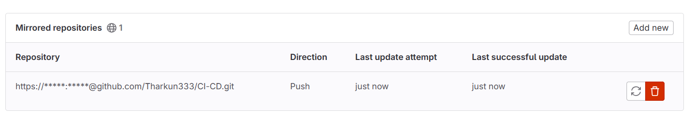

### Exercice 1 (Configuration de l’environnement local)

# Ajouter la clé GPG et le repository

curl -L https://packages.gitlab.com/install/repositories/runner/gitlab-runner/script.deb.sh | sudo bash

# Installation de gitlab-runner

sudo apt-get install gitlab-runner

# Enregistrement du runner avec Docker comme exécuteur

sudo gitlab-runner register --url https://gitlab.univ-lr.fr --token glrt-Tb18rC9uKJQ1yFz1oWEM

# Suivez les instructions pour enregistrer le runner, en spécifiant Docker comme l'exécuteur.

docker
docker:latest

# Installation de Python 3 et Poetry

sudo apt-get install python3 python3-pip
sudo pip install poetry

---

### Exercice 2 (Configuration du projet)

# Création d'un nouveau projet Python avec Poetry

poetry new my-arithmetic-$USER
cd my-arithmetic-$USER

# Configuration de pyproject.toml pour les tests avec Tox

[tool.poetry.dev-dependencies]
tox = "^3.24"

# Implémentation du code pour pgcd et des tests unitaires

# (Édition de arithmetic.py et test_arithmetic.py)

# arithmetic.py

nano arithmetic.py
def pgcd(a, b):
while b:
a, b = b, a % b
return a# arithmetic.py

# test_arithmetic.py

nano test_arithmetic.py
from arithmetic import pgcd

def test_pgcd():
assert pgcd(48, 18) == 6
assert pgcd(1071, 462) == 21

# Exécution des tests avec Tox

poetry install
poetry shell
sudo pip install --upgrade tox
tox

---

### Exercice 3 (Création d’un projet GitLab)

# Initialisation du dépôt GitLab

git init
git remote add origin https://gitlab.univ-lr.fr/gpeyrelo/ci-cd.git

# Configuration du pipeline CI/CD dans .gitlab-ci.yml

# (Ajout du fichier .gitlab-ci.yml avec les étapes de test)

nano .gitlab-ci.yml  
image: python:3.8
stages:

- test

unit_tests:
tags: - docker
stage: test
coverage: /TOTAL.\*\s+(\d+\%)$/
script: - pip install poetry - poetry install - poetry run pip install --upgrade tox - poetry run tox # - poetry run coverage run -m pytest # - poetry run coverage report

# Ajout du fichier au projet

git add .gitlab-ci.yml
git commit -m "Ajout .gitlab-ci.yml"
git branch -m master main
git push -u origin main

# Configuration pour le badge :

# Modifier le fichier pyproject.toml

nano pyproject.toml

[tool.poetry.dependencies]
python = "^3.8"
tox = "^3.24"
coverage = "_"
pytest = "_"

# Modifier le fichier de test

nano test_arithmetic.py

import unittest

if **name** == "**main**":
unittest.main()

# Ajouter la règle pour le badge de couverture dans .gitlab-ci.yml

# (Ajout du motif de couverture pour le badge)

coverage: /(?i)total.\*? (100(?:\.0+)?\%|[1-9]?\d(?:\.\d+)?\%)$/

---

### Exercice 4 (Déploiement automatique)

# Installation du plugin poetry-dynamic-versioning

poetry add poetry-dynamic-versioning --dev

# Ajout de la dépendance dans pyproject.toml

poetry-dynamic-versioning = "\*"

...

[tool.poetry-dynamic-versioning]
include-timestamp = true
enable-git-versioning = true

# Configuration du déploiement dans .gitlab-ci.yml

# (Ajout des étapes de déploiement pour les branches main et non-main, avec les règles)

satges :

- test
- deploy

...

deploy_stable:
stage: deploy
script: - echo "my-arithmetic-$USER deployment on stable servers"
    - poetry build
    - ls dist/
  rules:
    - if: '$CI_COMMIT_BRANCH == "main" && $CI_COMMIT_TAG != null'
when: on_success

deploy_develop:
stage: deploy
script: - echo "my-arithmetic-$USER deployment on develop server"
    - poetry build
    - ls dist/
  rules:
    - if: '$CI_COMMIT_BRANCH != "main" && $CI_COMMIT_TAG == null'
when: on_success

# Création d'un tag et envoi sur GitLab

git tag -a v1.0.0 -m "Release version 1.0.2"
git push origin main v1.0.2

### Exercice 5 (Mirroir GitLab et GitHub)

# Création du miroir entre GitLab et GitHub

# Génération du token sur GitHub :

- Accédez à votre compte GitHub.
- Cliquez sur votre avatar dans le coin supérieur droit et sélectionnez "Settings" (Paramètres).
- Dans la barre latérale gauche, sélectionnez "Developer settings" (Paramètres de développeur), puis cliquez sur "Personal access tokens" (Tokens d'accès personnels).
- Cliquez sur "Generate new token" (Générer un nouveau jeton).
- Donnez un nom à votre token, attribuez-lui des autorisations et générez-le.

# Sur GitLab :

Accédez aux paramètres de votre projet sur GitLab.
Allez dans la section "Repository" (Dépôt).
Sélectionnez "Mirroring repositories" (Miroir de dépôts).
Cliquez sur "Add new mirror repository" (Ajouter un nouveau dépôt miroir).

### Exercice 6 : Il n'a pas été fait
